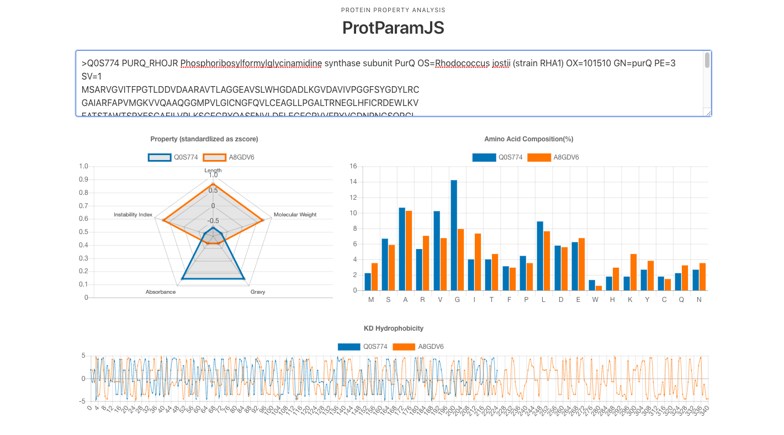

# ProtParamJS

ProtParamJS is a JavaScript version of ProtParam, and ProtParam is a tool to analyze a protein from several kinds of point of view.

[ExPASy](https://web.expasy.org/protparam/) defines ProtParam as follow:
> ProtParam (References / Documentation) is a tool which allows the computation of various physical and chemical parameters for a given protein stored in Swiss-Prot or TrEMBL or for a user entered protein sequence. The computed parameters include the molecular weight, theoretical pI, amino acid composition, atomic composition, extinction coefficient, estimated half-life, instability index, aliphatic index and grand average of hydropathicity (GRAVY) (Disclaimer).

### Installation

#### CDN

```
<script src="https://cdn.jsdelivr.net/npm/protparamjs@1.0.1/protparam.js"></script>
```

#### NPM
```
npm install protparamjs
```

### Quick Start
```
protparam = new ProtParam('AQEEGGGAS')
```

### Web App
You can apply ProtParamJS and compare several proteins on the web browser at https://kyu999.github.io/ProtParamJS/



---

### Reference
- [BioPython](https://biopython.org/)
- [ExPASy - ProtParam tool](https://web.expasy.org/protparam/)
